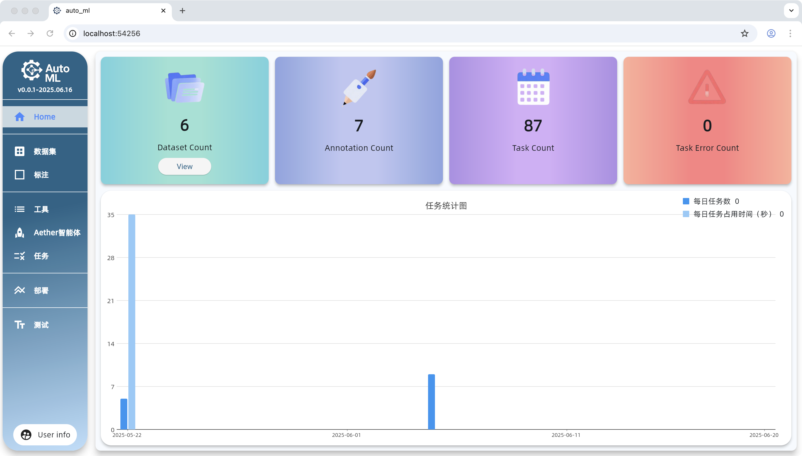
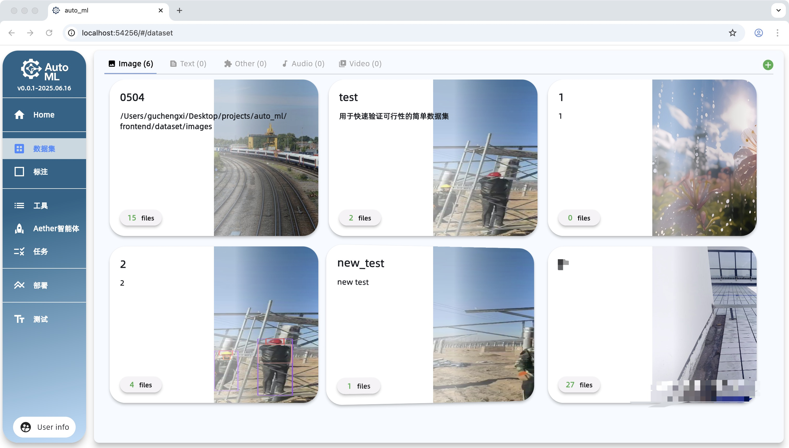
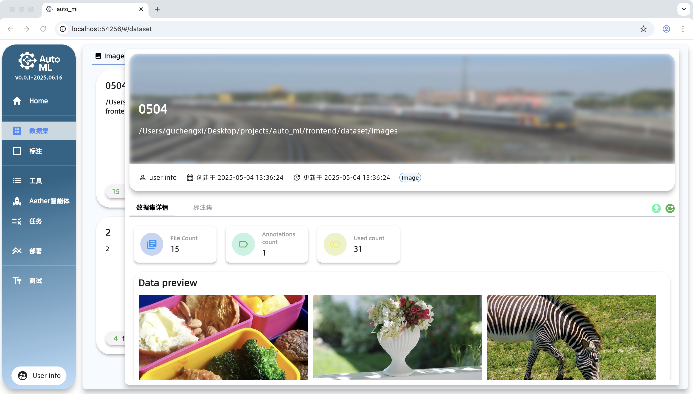
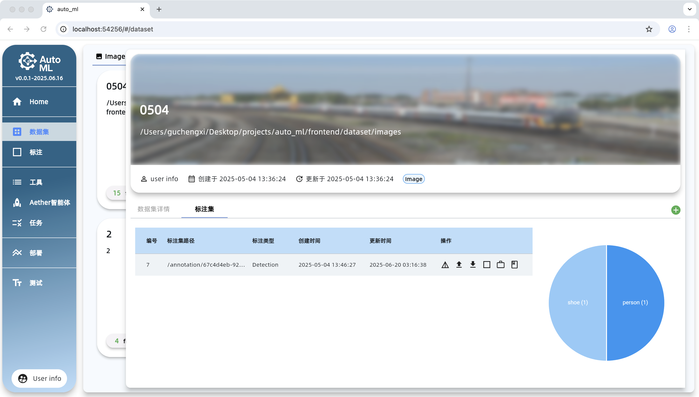
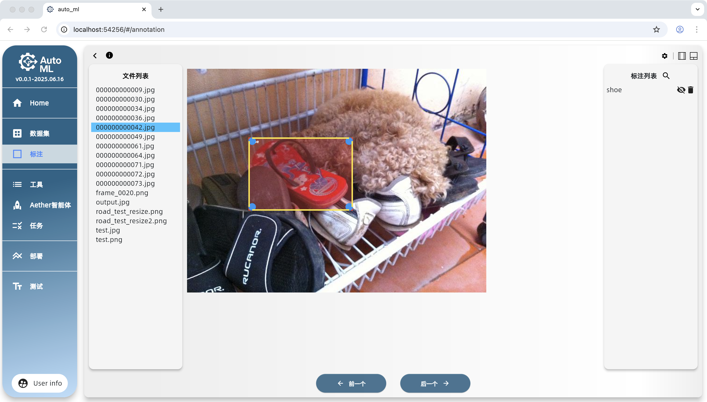
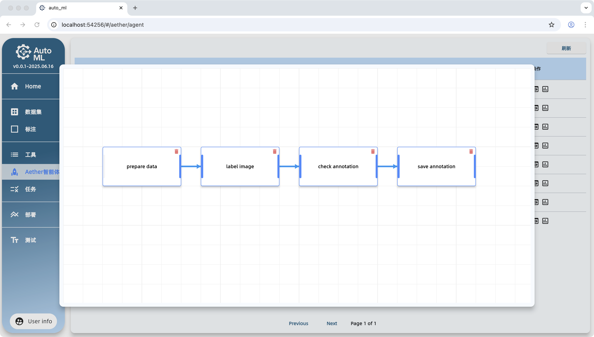
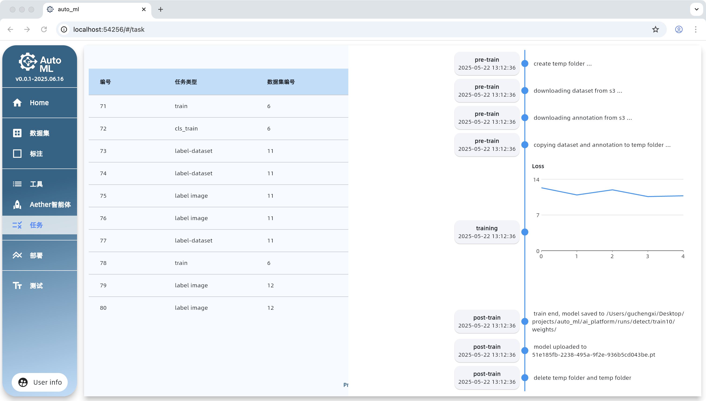
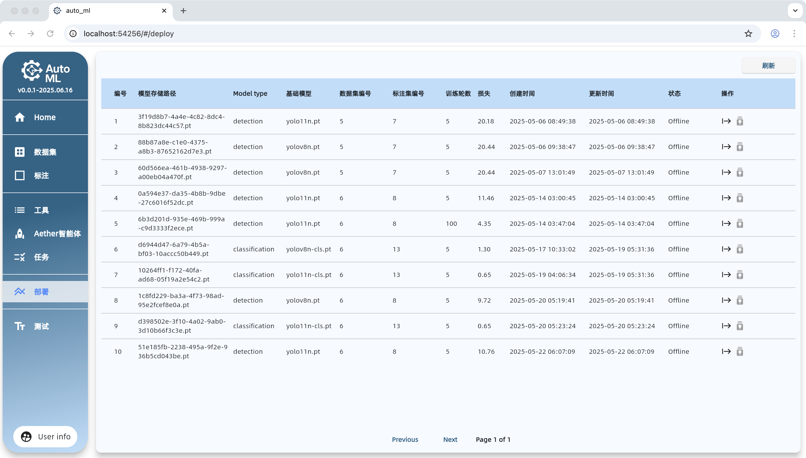



  

📘 其他语言版本

  <a href="README_en.md">English</a> | <a href="README.md">简体中文</a>

**注意：** 本项目处于早期开发阶段，暂不建议用于生产环境。

## 环境依赖

- Python 3.10+（AI 工具）
- Java（后端）
- Flutter（前端）
- FFmpeg（视频处理）
- Docker（用于运行 MySQL、Nacos、MinIO 等服务）

## 更新日志

- [CHANGELOG.md](./CHANGELOG.md)

## 截图预览

### 首页

### 数据集

| 示例1 | 示例2 | 示例3 |
| :--- | :---: | ---: |
|  |  |  |

### 标注界面

### 智能体

### 任务管理

### 部署界面

## BUG 列表

- [x] **[前端]** 浏览器缩放时图像缩放不一致（非关键渲染问题）
- [ ] **[前端]** 标注类为空字符串时不应展示类列表（优先级：P3）
- [x] **[前端]** 切换数据集后状态错误（优先级：P2）
- [ ] **[前端]** 自动标注后无法删除标注（优先级：P1）
- [ ] **[前端]** 自动标注后切换图像时未保存状态无提示（优先级：P3）
- [ ] **[前端]** 点击按钮后分类标注状态未更新（优先级：P2）
- [ ] **[AI/后端]** 有时无法正确解析大模型返回结果（优先级：P2）
- [ ] **[后端]** 上传文件列表，异常未正常捕获

## TODO 列表

- [ ] **[前端]** 实现国际化（i18n）多语言支持（优先级：P4）
- [ ] **[前端 & 后端]** 支持将多种数据源类型保存到本地 S3（优先级：P1）
  - [ ] 实现 ZIP 文件上传功能
- [ ] **[前端 & 后端]** 改进标注保存机制（优先级：P1）
  - [x] 弹出未保存确认提示框（优先级：P4）
  - [x] 实现手动保存按钮功能（优先级：P3）
  - [ ] 添加自动保存机制（定时或编辑触发，优先级：P1）
- [x] **[前端 & 后端]** 支持向数据集中追加新数据（优先级：P2）
- [ ] **[前端 & 后端]** 支持为已有数据集追加标注信息（优先级：P4）
- [ ] **[后端]** 实现大于 1024×1024 的图像缩放以提高 MLLM 检测准确率（优先级：P1）
- [ ] **[后端]** 增加标注框后处理，去除 >95% 重叠区域（优先级：P2）
- [ ] **[后端]** 上传文件列表，文件大小、数量未作限制
- [ ] **[前端]** 上传文件等操作之后，provider状态未强制更新，需要手动刷新之后才行

## 协助（HELP WANTED）

- [ ] **[前端]** 禁用 Flutter Web 的双指返回上一页操作（优先级：P2）

