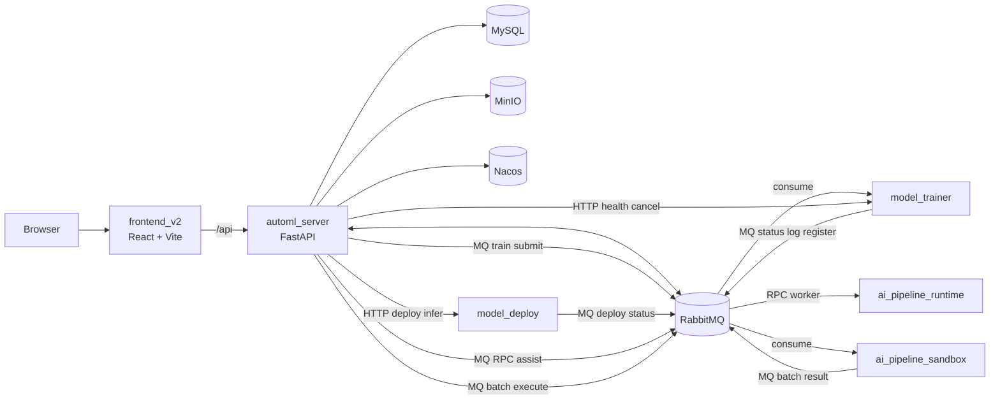

# AutoML Studio

面向多模态数据集、标注、训练、部署和 AI 辅助生产的统一工作台。当前除了常规标注工作流，也包含一整条批量标注链路：脚本包上传、任务编排、运行详情、失败重试、增量执行和结果预览都已经落在同一套平台内。

<div align="center">
  
</div>

## 平台能力

- 数据集管理：图像、文本、图文对话等多种数据形态
- 标注工作台：检测、分类、分割、姿态、LLM / MLLM、DPO 等标注类型
- 训练服务：当前以 YOLO 检测、分类训练为主
- 部署服务：当前以 ONNX 模型部署与在线推理为主
- AI Pipeline：资源绑定、模板管理、能力编排
- 批量标注：工具 ZIP 上传、任务详情、失败重试、增量运行、结果预览

## 整体架构


```mermaid
flowchart LR
    browser[Browser] --> frontend[frontend_v2\nReact + Vite]
    frontend -->|/api| server[automl_server\nFastAPI]

    server --> mysql[(MySQL)]
    server --> minio[(MinIO)]
    server --> nacos[(Nacos)]
    server <--> rabbit[(RabbitMQ)]

    server -->|MQ train submit| rabbit
    rabbit -->|consume| trainer[model_trainer]
    trainer -->|MQ status log register| rabbit
    server -->|HTTP health cancel| trainer

    server -->|HTTP deploy infer| deploy[model_deploy]
    deploy -->|MQ deploy status| rabbit

    server -->|MQ RPC assist| rabbit
    rabbit -->|RPC worker| runtime[ai_pipeline_runtime]

    server -->|MQ batch execute| rabbit
    rabbit -->|consume| sandbox[ai_pipeline_sandbox]
    sandbox -->|MQ batch result| rabbit
```

## 服务通信

| 链路 | 主通道 | 说明 |
| --- | --- | --- |
| `automl_server -> model_trainer` | `MQ` | 创建训练任务时，主服务把任务发布到 `trainer.task.queue` |
| `model_trainer -> automl_server` | `MQ` | 训练状态、训练日志、模型注册通过 `task.status.update`、`task.log`、`model.registered` 回传 |
| `automl_server <-> model_trainer` | `HTTP` | 当前只用于 `/health` 状态探测和 `/tasks/{task_id}/cancel` 取消请求 |
| `automl_server -> model_deploy` | `HTTP` | 部署、卸载、部署列表、部署健康和推理都直接调用 `model_deploy` HTTP API |
| `model_deploy -> automl_server` | `MQ` | 部署成功 / 卸载成功后，通过 `model.deployed`、`model.undeployed` 回传并更新主库 |
| `automl_server <-> ai_pipeline_runtime` | `MQ RPC` | 辅助标注和 pipeline 调用当前走 RabbitMQ RPC，不是直接 HTTP |
| `automl_server -> ai_pipeline_sandbox` | `MQ` | 批量标注 chunk 通过 `pipeline.batch.execute` 下发 |
| `ai_pipeline_sandbox -> automl_server` | `MQ` | 批量标注进度和结果通过 `pipeline.batch.progress`、`pipeline.batch.result` 回传 |

当前代码里虽然保留了 `service.heartbeat` 消息类型定义，但训练和部署服务并没有实际使用单独的 MQ 心跳消息。页面看到的服务状态，当前是主服务按需调用对应服务的 `/health`。

## 服务文档

| 服务 | 作用 | 文档 |
| --- | --- | --- |
| `frontend_v2` | 前端工作台，承载数据集、标注、训练、部署、AI Pipeline、批量标注页面 | [README](./frontend_v2/README.md) |
| `automl_server` | 主业务 API 与编排服务，负责数据、任务、事件流和批量标注落库 | [README](./automl_server/README.md) / [ARCHITECTURE](./automl_server/ARCHITECTURE.md) |
| `model_trainer` | 训练服务，消费训练任务并回传状态 | [README](./model_trainer/readme.md) |
| `model_deploy` | 部署与推理服务，管理模型运行时 | [README](./model_deploy/readme.md) |
| `ai_pipeline_runtime` | AI 能力运行时，负责图像理解、草稿标注、白框图相关能力 | [README](./ai_pipeline_runtime/readme.md) |
| `ai_pipeline_sandbox` | 批量标注脚本执行沙箱，负责 ZIP 脚本运行、依赖安装和结果回传 | [README](./ai_pipeline_sandbox/README.md) |

补充示例：

- [批量标注脚本 ZIP 示例](./readme/batch-script-zip-example/README.md)

## 批量标注当前能力

- 工具层：支持内置脚本和用户上传 ZIP 脚本包，根目录必须包含 `batch_script.json`，可选附带 `README.md`
- 管理层：工具列表支持启用、禁用、删除，详情抽屉可查看和编辑名称、描述与 `README.md`
- 运行层：任务详情页支持 SSE 实时进度、事件时间线、结果分页、原图预览、YOLO 结果叠加展示
- 续跑层：支持继续执行排队中的任务、仅重试失败项，以及对同一配置创建增量任务处理新增样本
- 执行层：`ai_pipeline_sandbox` 会自动创建独立工作目录、虚拟环境、安装依赖并复用缓存，关键步骤输出结构化日志和错误明细

## 目录结构

```text
auto_ml/
├── frontend_v2/
├── automl_server/
├── model_trainer/
├── model_deploy/
├── ai_pipeline_runtime/
├── ai_pipeline_sandbox/
├── mysql/
├── nacos/
├── readme/
├── docker-compose.yml
├── docker-compose.dev.yml
└── .env.example
```

## 环境要求

- Docker 20.10+
- Docker Compose v2
- Node.js `^20.19.0 || >=22.12.0`
- Python 3.10+
- pnpm `>=10`

## 快速开始

```bash
cp .env.example .env
docker compose up -d
```

默认访问地址：

- 前端：`http://localhost:3000`
- 主服务 API：`http://localhost:45678`
- Swagger UI：`http://localhost:45678/swagger-ui`
- 训练服务：`http://localhost:8081`
- 部署服务：`http://localhost:8082`
- AI Runtime：`http://localhost:8010`
- RabbitMQ 管理台：`http://localhost:15672`
- MinIO Console：`http://localhost:9010`
- Nacos：`http://localhost:8848`

说明：

- `ai_pipeline_sandbox` 通过容器内部 `8011` 端口提供健康检查，不默认映射到宿主机
- 前端容器通过 `/api` 反向代理到 `automl_server`

## 本地开发

先启动依赖和批量标注沙箱：

```bash
docker compose -f docker-compose.dev.yml up -d mysql rabbitmq minio minio-init nacos nacos-init ai-pipeline-sandbox
```

前端：

```bash
cd frontend_v2
pnpm install
pnpm dev
```

主服务：

```bash
cd automl_server
pip install -r requirements.txt
python run.py
```

其他子服务按需启动，具体看各自 README。

## 配置说明

- 运行时配置以 Nacos 的 `AUTO_ML_CONFIG` 为主，配置源文件在 [nacos/automl-config.yaml](./nacos/automl-config.yaml)
- 根目录 [.env.example](./.env.example) 主要用于 `docker-compose.yml` 的引导环境
- `automl_server/.env.example` 用于主服务本地直跑
- `frontend_v2/.env.example` 用于前端开发与构建
- 批量标注相关重点配置：
  - `ai-pipeline-batch.secret_key`：加密保存脚本 `secret` 参数，必须保持稳定
  - `ai-pipeline-sandbox`：控制脚本超时、内存、进程数、venv 目录、pip 缓存与索引源
  - `rabbitmq`：包含 `pipeline_batch_execute`、`pipeline_batch_progress`、`pipeline_batch_result` 队列与路由键

## 数据库与迁移

- 初始化脚本：`mysql/init/01_init_automl.sql`
- 增量迁移：`mysql/migrations/*.sql`

最近和批量标注相关的迁移包括：

- `20260728_create_ai_pipeline_batch_annotation.sql`
- `20260728_add_user_batch_scripts.sql`
- `20260729_add_batch_annotation_incremental_runs.sql`
- `20260730_add_batch_script_readme.sql`

## 致谢

本项目基于以下开源项目构建：

- [FastAPI](https://fastapi.tiangolo.com/)
- [React](https://react.dev/)
- [Vite](https://vite.dev/)
- [Ant Design](https://ant.design/)
- [Konva](https://konvajs.org/)
- [Ultralytics YOLO](https://github.com/ultralytics/ultralytics)
- [RabbitMQ](https://www.rabbitmq.com/)
- [MinIO](https://min.io/)
- [Nacos](https://nacos.io/)
- [Docker](https://www.docker.com/)
