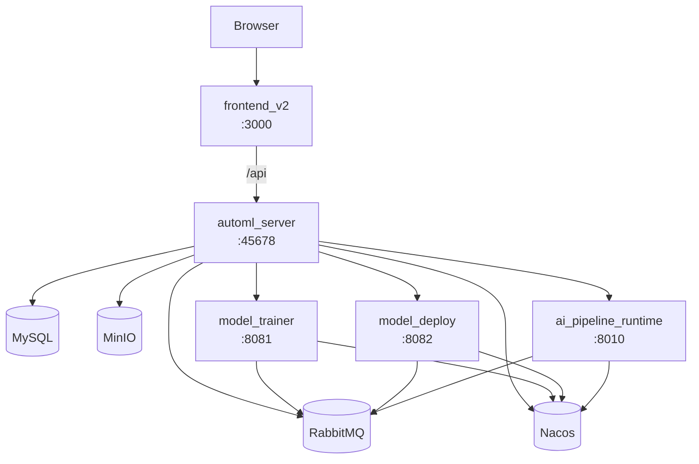

# AutoML Studio

一套面向多模态数据集管理、标注、训练、部署和 AI 辅助标注的平台，覆盖图像、文本、图文对话和偏好标注等场景。

<div align="center">
  
</div>

## 平台范围

- 数据集管理：图像、文本、图文对话等数据
- 标注工作台：检测、分类、分割、姿态、LLM/MLLM 对话、DPO 偏好标注
- 训练服务：当前主要支持 YOLO 检测与分类训练
- 部署服务：当前主要支持 ONNX 模型部署与推理
- AI 辅助标注：图像理解、草稿标注、白框图生成与提取

## 可插拔能力

`model_trainer`、`model_deploy` 和 `ai_pipeline_runtime` 是按需启用的扩展服务，不要求随核心平台一起常驻启动。后续新增训练后端、推理后端或 AI 能力时，可以继续按同样方式接入。

## 组成

- `frontend_v2`: React + TypeScript 前端，Vite 开发，默认端口 `3000`
- `automl_server`: 主业务 API，统一编排数据集、标注、任务、部署与 AI Pipeline，默认端口 `45678`
- `model_trainer`: 可选训练服务，默认端口 `8081`
- `model_deploy`: 可选部署服务，默认端口 `8082`
- `ai_pipeline_runtime`: 可选 AI 能力运行时，默认端口 `8010`
- 基础设施：MySQL、MinIO、RabbitMQ、Nacos

## 整体架构


```mermaid
flowchart TB
    B[Browser] --> F[frontend_v2\n:3000]
    F -->|/api| S[automl_server\n:45678]

    S --> DB[(MySQL)]
    S --> M[(MinIO)]
    S --> Q[(RabbitMQ)]
    S --> N[(Nacos)]
    S --> T[model_trainer\n:8081]
    S --> D[model_deploy\n:8082]
    S --> A[ai_pipeline_runtime\n:8010]

    T --> Q
    D --> Q
    A --> Q
    T --> N
    D --> N
    A --> N
```

## 目录

```text
auto_ml/
├── frontend_v2/
├── automl_server/
├── model_trainer/
├── model_deploy/
├── ai_pipeline_runtime/
├── mysql/
├── nacos/
├── docker-compose.yml
├── docker-compose.dev.yml
└── .env.example
```

## 环境要求

- Docker 20.10+
- Docker Compose v2
- Node.js `^20.19.0 || >=22.12.0`
- Python 3.10+
- pnpm `>=10`

## 快速开始

### 1. 启动核心平台

```bash
cp .env.example .env
docker compose up -d
```

服务地址：

- 前端：`http://localhost:3000`
- 主服务 API：`http://localhost:45678`
- Swagger UI：`http://localhost:45678/swagger-ui`
- 训练服务：`http://localhost:8081`
- 部署服务：`http://localhost:8082`
- AI 运行时：`http://localhost:8010`
- RabbitMQ：`http://localhost:15672`
- MinIO：`http://localhost:9010`
- Nacos：`http://localhost:8848`

子服务启用后，对应端口才会对外可用。

### 2. 本地开发

```bash
docker compose -f docker-compose.dev.yml up -d mysql rabbitmq minio nacos nacos-init
```

前端：

```bash
cd frontend_v2
pnpm install
pnpm dev
```

主服务：

```bash
cd automl_server
pip install -r requirements.txt
python run.py
```

按需启用的子服务：

- `model_trainer/server.py`
- `model_deploy/server.py`
- `ai_pipeline_runtime/app.py`

## 配置

- 根目录 [.env.example](./.env.example) 用于 `docker-compose.yml`
- `automl_server/.env.example` 用于主服务本地直跑
- `frontend_v2/.env.example` 用于前端开发和构建
- `nacos/automl-config.yaml` 是 Nacos 配置源

## 文档

- [主服务架构](./automl_server/ARCHITECTURE.md)
- [训练服务说明](./model_trainer/readme.md)
- [部署服务说明](./model_deploy/readme.md)
- [AI 运行时说明](./ai_pipeline_runtime/readme.md)

## 数据库

- 初始化脚本：`mysql/init/01_init_automl.sql`
- 迁移脚本：`mysql/migrations/*.sql`

## 运行说明

- `docker-compose.yml` 会拉起核心平台，子服务按需启用
- `/api` 由前端容器反向代理到主服务
- 平台运行配置主要由 Nacos 提供，`.env.example` 用于本地开发和容器启动
- 各服务 `/health` 会返回版本信息，子服务当前统一为 `1.0.0`

## 致谢

本项目基于以下开源项目构建：

- [FastAPI](https://fastapi.tiangolo.com/)
- [React](https://react.dev/)
- [Vite](https://vite.dev/)
- [Ant Design](https://ant.design/)
- [Konva](https://konvajs.org/)
- [Ultralytics YOLO](https://github.com/ultralytics/ultralytics)
- [RabbitMQ](https://www.rabbitmq.com/)
- [MinIO](https://min.io/)
- [Nacos](https://nacos.io/)
- [Docker](https://www.docker.com/)
