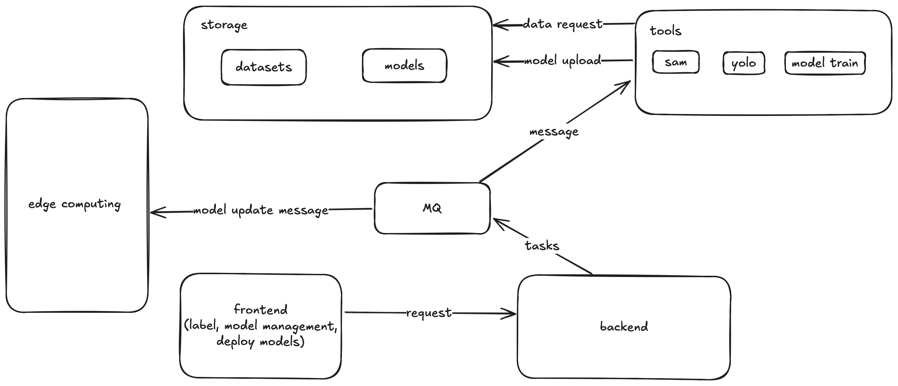

  

### framework

**Notice:** This project is in the early stages of development. Please do not use it in a production environment.

### requirements

* python3.10+ (AI tools)
* java (backend)
* flutter (frontend)
* ffmpeg (video processing)
* docker (mysql, rnacos, minio)

### features

* home

* dataset

| 1      | 2 | 3     |
| :---        |    :----:   |          ---: |
|       |         |   |

* annotation

* agent

* task

* deploy

### BUG list
* [x] **[Frontend]** Image scaling inconsistent with browser resize (non-critical rendering issue)
* [ ] **[Frontend]** Dont show classes list if annotation class is an empty string (Priority: P3)
* [ ] **[Frontend]** State error after switch to other datasets (Priority: P2)
* [ ] **[Frontend]** Cannot delete annotation after auto-label(Priority: P1)
* [ ] **[Frontend]** Cls annotation state not change after trigger button(Priority: P2)
* [ ] **[AI,backend]** Sometimes, cannot parse LLM results(Priority: P2)

### TODO list
* [ ] **[frontend]** Implement i18n localization support (Priority: P4)
* [ ] **[frontend，backend]**  Add support for saving additional data source types to local S3 (Priority: P1)
    * [ ] Enable ZIP file upload functionality
* [ ] **[frontend，backend]** Improve annotation persistence mechanism (Priority: P1)
    * [x] Display unsaved changes confirmation dialog (Priority: P4)
    * [x] Implement manual save button functionality (Priority: P3)
    * [ ] Add automatic save feature (triggered by timer/edits) (Priority: P1)
* [x] **[frontend，backend]** Implement dataset append functionality for new data (Priority: P2)
* [ ] **[frontend，backend]** Add annotation append support for existing datasets (Priority: P4)
* [ ] **[backend]** Implement image resizing (>1024×1024) to improve MLLM detection accuracy (Priority: P1)
* [ ] **[backend]** Add bounding box post-processing to remove >95% overlapping regions (Priority: P2)

### HELP WANTED
* [ ] **[frontend]** disable dual finger return to the previous page in Flutter Web (Priority: P2)
