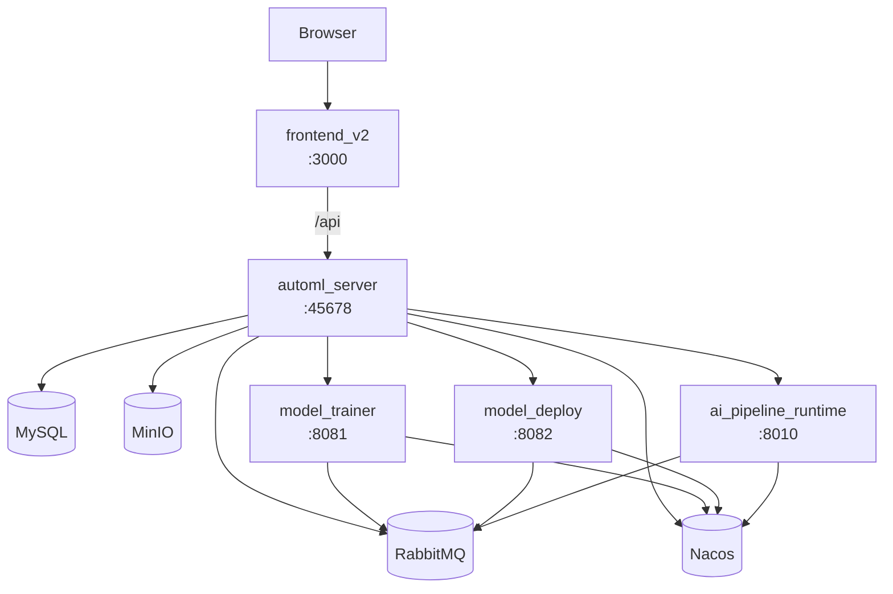

# AutoML Platform

A computer-vision platform for datasets, annotation, training, deployment, and AI-assisted workflows.

<div align="center">
  
</div>

## Components

- `frontend_v2`: React + TypeScript frontend, Vite dev server, default port `3000`
- `automl_server`: main API service, default port `45678`
- `model_trainer`: training service, default port `8081`
- `model_deploy`: deployment service, default port `8082`
- `ai_pipeline_runtime`: AI runtime service, default port `8010`
- Infrastructure: MySQL, MinIO, RabbitMQ, Nacos

## Architecture


```mermaid
flowchart TB
    B[Browser] --> F[frontend_v2\n:3000]
    F -->|/api| S[automl_server\n:45678]

    S --> DB[(MySQL)]
    S --> M[(MinIO)]
    S --> Q[(RabbitMQ)]
    S --> N[(Nacos)]
    S --> T[model_trainer\n:8081]
    S --> D[model_deploy\n:8082]
    S --> A[ai_pipeline_runtime\n:8010]

    T --> Q
    D --> Q
    A --> Q
    T --> N
    D --> N
    A --> N
```

## Repository Layout

```text
auto_ml/
├── frontend_v2/
├── automl_server/
├── model_trainer/
├── model_deploy/
├── ai_pipeline_runtime/
├── mysql/
├── nacos/
├── docker-compose.yml
├── docker-compose.dev.yml
└── .env.example
```

## Requirements

- Docker 20.10+
- Docker Compose v2
- Node.js `^20.19.0 || >=22.12.0`
- Python 3.10+
- pnpm `>=10`

## Quick Start

### 1. Start the full stack

```bash
cp .env.example .env
docker compose up -d
```

Endpoints:

- Frontend: `http://localhost:3000`
- Main API: `http://localhost:45678`
- Swagger UI: `http://localhost:45678/swagger-ui`
- Trainer: `http://localhost:8081`
- Deploy: `http://localhost:8082`
- AI runtime: `http://localhost:8010`
- RabbitMQ: `http://localhost:15672`
- MinIO: `http://localhost:9010`
- Nacos: `http://localhost:8848`

### 2. Local development

```bash
docker compose -f docker-compose.dev.yml up -d mysql rabbitmq minio nacos nacos-init
```

Frontend:

```bash
cd frontend_v2
pnpm install
pnpm dev
```

Main service:

```bash
cd automl_server
pip install -r requirements.txt
python run.py
```

Other services:

- `model_trainer/server.py`
- `model_deploy/server.py`
- `ai_pipeline_runtime/app.py`

## Configuration

- Root [.env.example](./.env.example) is used by `docker-compose.yml`
- `automl_server/.env.example` is for standalone backend runs
- `frontend_v2/.env.example` is for frontend development/builds
- `nacos/automl-config.yaml` is the Nacos config source

## Docs

- [Main service architecture](./automl_server/ARCHITECTURE.md)
- [Trainer service](./model_trainer/readme.md)
- [Deploy service](./model_deploy/readme.md)
- [AI runtime](./ai_pipeline_runtime/readme.md)

## Database

- Initial schema: `mysql/init/01_init_automl.sql`
- Migrations: `mysql/migrations/*.sql`

## Notes

- `docker-compose.yml` starts both frontend and backend services
- `/api` is proxied from the frontend container to the main service
- Keep Nacos config and env examples aligned when adding new settings

## Acknowledgments

This project is built on top of the following open-source projects:

- [FastAPI](https://fastapi.tiangolo.com/)
- [React](https://react.dev/)
- [Vite](https://vite.dev/)
- [Ant Design](https://ant.design/)
- [Konva](https://konvajs.org/)
- [Ultralytics YOLO](https://github.com/ultralytics/ultralytics)
- [RabbitMQ](https://www.rabbitmq.com/)
- [MinIO](https://min.io/)
- [Nacos](https://nacos.io/)
- [Docker](https://www.docker.com/)
