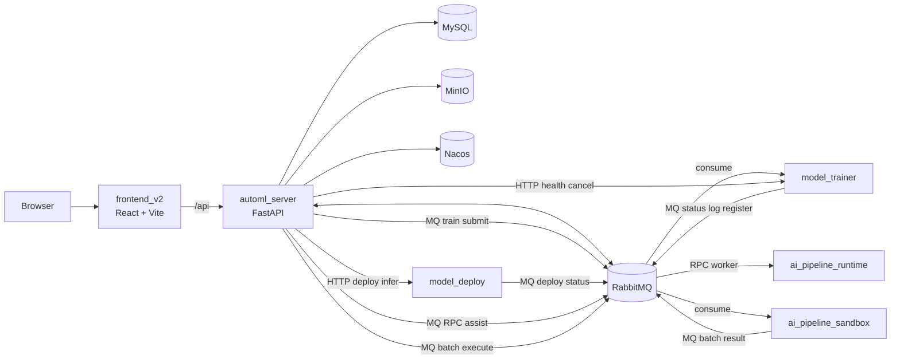

# AutoML Studio

[简体中文](./README.md) | [English](./README_en.md)

An integrated workspace for multi-modal datasets, annotation, training, deployment, and AI-assisted production. In addition to the regular annotation flow, the platform now includes a full batch annotation pipeline: script ZIP upload, task orchestration, live run detail, failed-item retry, incremental execution, and result preview.

<div align="center">
  
</div>

## Capabilities

- Dataset management for images, text, and multimodal conversation data
- Annotation workbenches for detection, classification, segmentation, pose, LLM / MLLM, and DPO workflows
- Training services, currently focused on YOLO detection and classification
- Deployment services, currently focused on ONNX deployment and online inference
- AI Pipeline for resource binding, template management, and capability orchestration
- Batch annotation with tool ZIP upload, run detail, retry, incremental execution, and result preview

## Architecture


```mermaid
flowchart LR
    browser[Browser] --> frontend[frontend_v2\nReact + Vite]
    frontend -->|/api| server[automl_server\nFastAPI]

    server --> mysql[(MySQL)]
    server --> minio[(MinIO)]
    server --> nacos[(Nacos)]
    server <--> rabbit[(RabbitMQ)]

    server -->|MQ train submit| rabbit
    rabbit -->|consume| trainer[model_trainer]
    trainer -->|MQ status log register| rabbit
    server -->|HTTP health cancel| trainer

    server -->|HTTP deploy infer| deploy[model_deploy]
    deploy -->|MQ deploy status| rabbit

    server -->|MQ RPC assist| rabbit
    rabbit -->|RPC worker| runtime[ai_pipeline_runtime]

    server -->|MQ batch execute| rabbit
    rabbit -->|consume| sandbox[ai_pipeline_sandbox]
    sandbox -->|MQ batch result| rabbit
```

## Service Docs

| Service | Role | Docs |
| --- | --- | --- |
| `frontend_v2` | Frontend workspace for datasets, annotation, training, deployment, AI Pipeline, and batch annotation pages | [README](./frontend_v2/README.md) |
| `automl_server` | Main API and orchestration service for data, tasks, streams, and batch annotation persistence | [README](./automl_server/README.md) / [ARCHITECTURE](./automl_server/ARCHITECTURE.md) |
| `model_trainer` | Training service that consumes training jobs and sends status updates back | [README](./model_trainer/readme.md) |
| `model_deploy` | Deployment and inference service that manages runtime instances | [README](./model_deploy/readme.md) |
| `ai_pipeline_runtime` | AI capability runtime for image understanding, draft annotation, and white-overlay related flows | [README](./ai_pipeline_runtime/readme.md) |
| `ai_pipeline_sandbox` | Batch annotation script sandbox for ZIP execution, dependency install, and result callbacks | [README](./ai_pipeline_sandbox/README.md) |
| `training_code_runtime` | Experimental training-code runtime; currently validates versioned package, I/O, and MQ contracts without executing code | [README](./training_code_runtime/README.md) |

Additional example:

- [Batch annotation script ZIP example](./readme/batch-script-zip-example/README.md)

## Service Communication

| Flow | Main channel | Notes |
| --- | --- | --- |
| `automl_server -> model_trainer` | `MQ` | Training jobs are published to `trainer.task.queue` |
| `model_trainer -> automl_server` | `MQ` | Task status, task logs, and model registration are sent back over MQ |
| `automl_server <-> model_trainer` | `HTTP` | Used only for `/health` probing and `/tasks/{task_id}/cancel` |
| `automl_server -> model_deploy` | `HTTP` | Deploy, undeploy, deployment listing, deployment health, and inference are all direct HTTP calls |
| `model_deploy -> automl_server` | `MQ` | Successful deploy / undeploy is synced back through `model.deployed` and `model.undeployed` |
| `automl_server <-> ai_pipeline_runtime` | `MQ RPC` | Assist annotation and pipeline execution currently use RabbitMQ RPC rather than direct HTTP |
| `automl_server -> ai_pipeline_sandbox` | `MQ` | Batch chunks are published through `pipeline.batch.execute` |
| `ai_pipeline_sandbox -> automl_server` | `MQ` | Batch progress and results are returned through `pipeline.batch.progress` and `pipeline.batch.result` |

The codebase still defines `service.heartbeat` as a message type, but trainer and deploy do not actively use a standalone MQ heartbeat right now. The status shown in the UI is currently based on on-demand `/health` checks from `automl_server`.

## Current Batch Annotation Features

- Tool layer: built-in scripts and uploaded ZIP script packages, with required root `batch_script.json` and optional root `README.md`
- Management layer: tool list supports enable, disable, delete, and a detail drawer for editing name, description, and `README.md`
- Run layer: run detail page supports SSE live progress, event timeline, paged results, original image preview, and YOLO overlay preview
- Resume layer: continue queued runs, retry failed items only, and create incremental runs for newly added samples under the same configuration
- Execution layer: `ai_pipeline_sandbox` creates isolated work directories, virtual environments, dependency caches, and structured error logs

## Repository Layout

```text
auto_ml/
├── frontend_v2/
├── automl_server/
├── model_trainer/
├── model_deploy/
├── ai_pipeline_runtime/
├── ai_pipeline_sandbox/
├── training_code_runtime/  # Experimental; does not replace model_trainer yet
├── mysql/
├── nacos/
├── readme/
├── docker-compose.yml
├── docker-compose.dev.yml
└── .env.example
```

## Requirements

- Docker 20.10+
- Docker Compose v2
- Node.js `^20.19.0 || >=22.12.0`
- Python 3.10+
- pnpm `>=10`

## Quick Start

```bash
cp .env.example .env
docker compose up -d
```

Default endpoints:

- Frontend: `http://localhost:3000`
- Main API: `http://localhost:45678`
- Swagger UI: `http://localhost:45678/swagger-ui`
- Trainer: `http://localhost:8081`
- Deploy: `http://localhost:8082`
- AI Runtime: `http://localhost:8010`
- RabbitMQ console: `http://localhost:15672`
- MinIO console: `http://localhost:9010`
- Nacos: `http://localhost:8848`

Notes:

- `ai_pipeline_sandbox` exposes its health endpoint on internal port `8011` and is not mapped to the host by default
- The frontend container proxies `/api` to `automl_server`

## Local Development

Start the core dependencies and the batch annotation sandbox first:

```bash
docker compose -f docker-compose.dev.yml up -d mysql rabbitmq minio minio-init nacos nacos-init ai-pipeline-sandbox
```

Frontend:

```bash
cd frontend_v2
pnpm install
pnpm dev
```

Main service:

```bash
cd automl_server
pip install -r requirements.txt
python run.py
```

Start the other services on demand as described in their own READMEs.

## Configuration

- Runtime configuration is primarily driven by Nacos `AUTO_ML_CONFIG`, with [nacos/automl-config.yaml](./nacos/automl-config.yaml) as the source file
- Root [.env.example](./.env.example) is mainly for `docker-compose.yml` bootstrap values
- `automl_server/.env.example` is for standalone backend runs
- `frontend_v2/.env.example` is for frontend development and builds
- Batch annotation highlights:
  - `ai-pipeline-batch.secret_key`: required to encrypt and decrypt script `secret` parameters
  - `ai-pipeline-sandbox`: controls timeout, memory, process count, venv paths, pip cache, and pip indexes
  - `rabbitmq`: includes `pipeline_batch_execute`, `pipeline_batch_progress`, and `pipeline_batch_result` queues and routing keys

## Database and Migrations

- Initial schema: `mysql/init/01_init_automl.sql`
- Incremental migrations: `mysql/migrations/*.sql`

Recent batch annotation related migrations include:

- `20260728_create_ai_pipeline_batch_annotation.sql`
- `20260728_add_user_batch_scripts.sql`
- `20260729_add_batch_annotation_incremental_runs.sql`
- `20260730_add_batch_script_readme.sql`

## Acknowledgments

This project is built on top of the following open-source projects:

- [FastAPI](https://fastapi.tiangolo.com/)
- [React](https://react.dev/)
- [Vite](https://vite.dev/)
- [Ant Design](https://ant.design/)
- [Konva](https://konvajs.org/)
- [Ultralytics YOLO](https://github.com/ultralytics/ultralytics)
- [RabbitMQ](https://www.rabbitmq.com/)
- [MinIO](https://min.io/)
- [Nacos](https://nacos.io/)
- [Docker](https://www.docker.com/)
