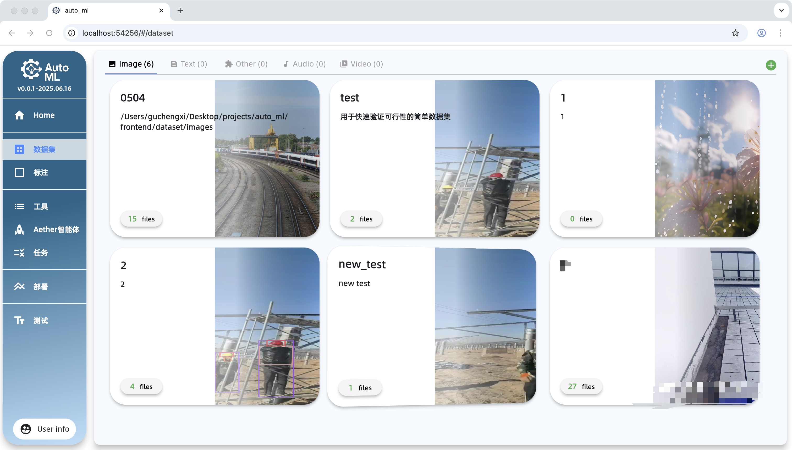
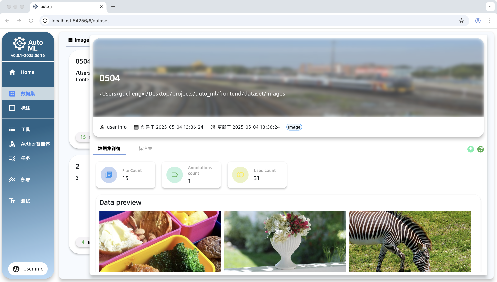
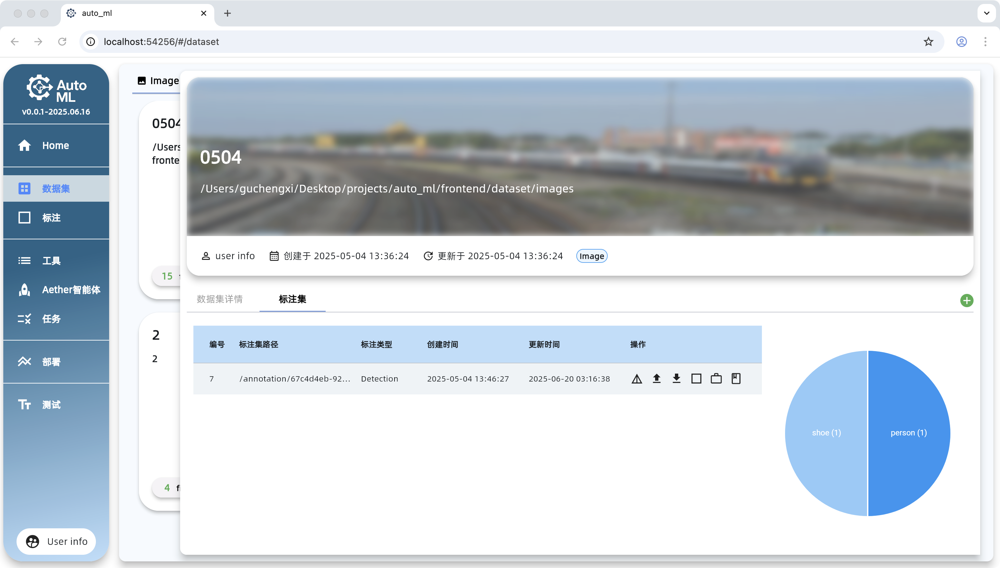
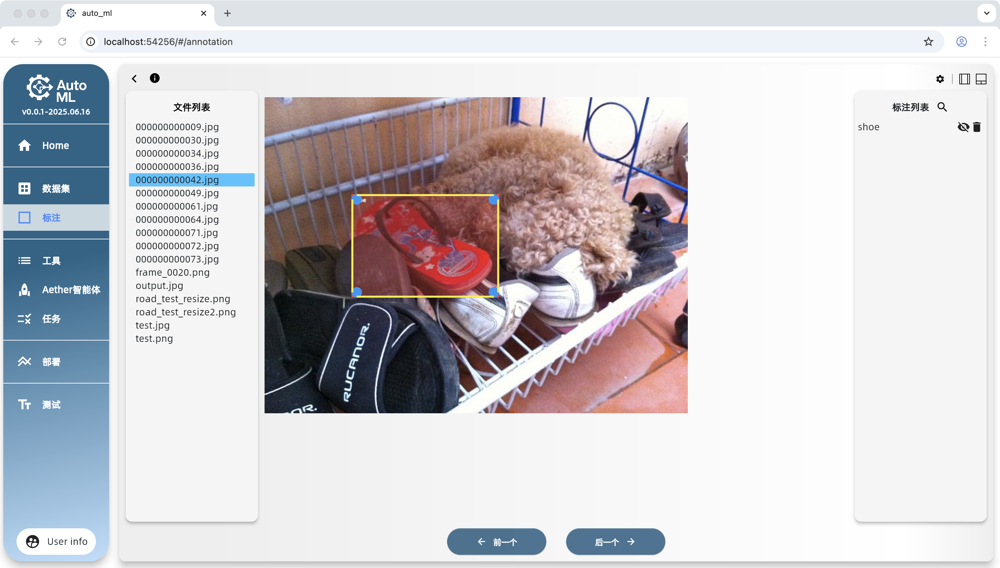
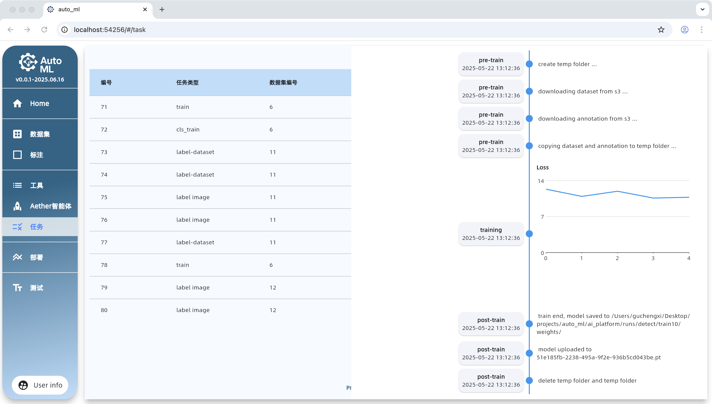

  

📘 Other Language Versions

  <a href="README_en.md">English</a> | <a href="README.md">Simplified Chinese</a>

**Note:** This project is in the early development stage and is not recommended for production environments.

## Environment Dependencies

- Python 3.10+ (AI tools)
- Java (backend)
- Flutter (frontend)
- FFmpeg (video processing)
- Docker (for running services such as MySQL, Nacos, MinIO)

## Changelog

- [CHANGELOG.md](./CHANGELOG.md)

## Screenshot Preview

### Homepage

### Dataset

| Example 1 | Example 2 | Example 3 |
| :--- | :---: | ---: |
|  |  |  |

### Annotation Interface

### Agent

### Task Management

### Deployment Interface

## Bug List

- [x] **[Frontend]** Inconsistent image scaling when browser is zoomed (non-critical rendering issue)
- [ ] **[Frontend]** Class list should not be displayed when annotation class is an empty string (Priority: P3)
- [x] **[Frontend]** Incorrect state after switching datasets (Priority: P2)
- [ ] **[Frontend]** Cannot delete annotations after automatic annotation (Priority: P1)
- [ ] **[Frontend]** No prompt for unsaved state when switching images after automatic annotation (Priority: P3)
- [ ] **[Frontend]** Classification annotation state not updated after clicking the button (Priority: P2)
- [ ] **[AI/Backend]** Sometimes fails to correctly parse large model return results (Priority: P2)
- [ ] **[Backend]** Exceptions not properly caught in the upload file list

## TODO List

- [ ] **[Frontend]** Implement internationalization (i18n) multi-language support (Priority: P4)
- [ ] **[Frontend & Backend]** Support saving multiple data source types to local S3 (Priority: P1)
  - [ ] Implement ZIP file upload function
- [ ] **[Frontend & Backend]** Improve annotation saving mechanism (Priority: P1)
  - [x] Pop up unsaved confirmation prompt (Priority: P4)
  - [x] Implement manual save button function (Priority: P3)
  - [ ] Add automatic save mechanism (triggered by timing or editing, Priority: P1)
- [x] **[Frontend & Backend]** Support appending new data to datasets (Priority: P2)
- [ ] **[Frontend & Backend]** Support appending annotation information to existing datasets (Priority: P4)
- [ ] **[Backend]** Implement image scaling for images larger than 1024×1024 to improve MLLM detection accuracy (Priority: P1)
- [ ] **[Backend]** Add post-processing for annotation boxes to remove overlapping areas >95% (Priority: P2)
- [ ] **[Backend]** No restrictions on file size and quantity in the upload file list
- [ ] **[Frontend]** After operations such as file upload, the provider state is not forced to update and requires manual refresh

## HELP WANTED

- [ ] **[Frontend]** Disable two-finger back navigation in Flutter Web (Priority: P2)
